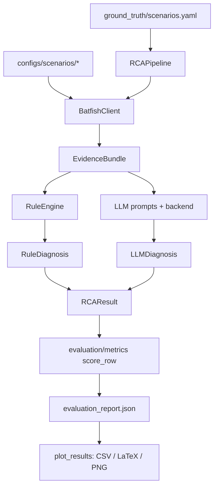

# How Campus RCA data generation works (under the hood)

This document explains how data flows from authored configs to dissertation tables/charts for the **current dual-core / dual-edge / 10-scenario** lab.

Topology reference: [`topology/README.md`](topology/README.md).

---

## 1. Scenario catalogue (what to test)

**`ground_truth/scenarios.yaml`** lists **10** labelled campus faults. Each entry defines:

- `id`, `snapshot_dir`, optional `block` (building/floor)
- `symptom` (operator text)
- `probe` (src/dst IP, port, protocol) — Batfish test flow
- `ground_truth` (fault type, device, keywords) — scoring only

Examples: `student_acl_deny_mgt`, `wrong_default_route_r1`, `missing_ospf_dns_services`.

---

## 2. Network data (the injected faults)

| Path | Role |
|---|---|
| `configs/baseline/` | Known-good dual-core dual-edge by-block campus |
| `configs/scenarios/<id>/` | Baseline copy with **one** deliberate fault |
| `scripts/generate_campus_topology.py` | Rebuilds baseline + all 10 scenario snapshots |

Devices include `campus_r1/r2`, `fw1/fw2`, `core_sw1/sw2`, and per-block DSWs (`dsw_a_admin`, `dsw_b_student`, …).

Policies come from campus lab notes (`STUDENT-FILTER`, `GUEST-WLAN-FILTER`, `DMZ-IN`, OSPF area 0).

Hosts (`student_pc`, `acad_pc`, `dns_srv`, `web_dmz`, …) provide Batfish endpoints.

---

## 3. Evidence generation — `batfish_client.py`

With Offline **unchecked** / `USE_BATFISH=true`:

1. Connect to Batfish  
2. `init_snapshot(configs/scenarios/<id>)`  
3. Collect `initIssues`, interfaces, routes, traceroute, reachability, `testFilters`  
4. Wrap as **`EvidenceBundle`**  
5. Cache under `data/evidence_cache/<id>.json`

With Offline **checked**:

- Uses scenario-aligned **synthetic** evidence (for demos/CI when Batfish is down)

---

## 4. Orchestration — `pipeline.py`

`RCAPipeline.run_scenario(scenario, mode)`:

| Mode | Runs | Who decides fault/device |
|---|---|---|
| `rule_only` | RuleEngine | Rules |
| `llm_only` | LLM only | LLM |
| `hybrid` | Rules then LLM explain | **Rules** (LLM explains) |

Output: **`RCAResult`**.

GUI Diagnose / CLI call this once; Evaluate loops **10 scenarios × 3 modes**.

---

## 5. Rules — `rules/engine.py`

Deterministic rules over evidence (router nodes only — not host defaults):

- **R1** ACL deny — DENY / denied dispositions (`STUDENT-FILTER`, `GUEST-WLAN-FILTER`, `DMZ-IN`, …)  
- **R2** Interface down — Active/Admin_Up false on cores/FW/DSW  
- **R3** Wrong static — edge default next-hop into campus LAN  
- **R4** Missing route — NO_ROUTE / prefix absent at cores (owned by DSW block)  
- **R5** OSPF neighbor issues  
- **R0** Reachability OK (suppressed when deny/no_route present)

---

## 6. LLM — `llm/prompts.py` + `llm/backend.py`

1. Compact evidence (router-focused)  
2. Call Ollama/OpenAI/mock with JSON schema  
3. Parse/repair JSON → **`LLMDiagnosis`**  
4. Soft-fail to rule diagnosis if JSON is invalid (hybrid stays usable)

---

## 7. Evaluation — `evaluation/metrics.py` + `run_eval.py`

| Metric | Meaning |
|---|---|
| `localisation_correct` | fault type **and** device match |
| `keyword_coverage` | GT keywords in explanation |
| `hallucination_rate` | LLM claim flags |
| `evidence_faithfulness` | cited refs exist in evidence |
| `elapsed_ms` | wall time |

Writes `evaluation_report.json` + `.md` (GUI: `results/gui_eval/`).

---

## 8. Tables & charts — `evaluation/plot_results.py`

From `evaluation_report.json`:

- CSV summary/rows  
- LaTeX tables  
- PNG charts (matplotlib; **Pillow fallback on WSL**)

Triggers: Evaluate finish, Results → **Generate figures**, or `make figures`.

---

## 9. UI — `gui.py` / `run.sh`

| Tab | Role |
|---|---|
| Setup | uv, Ollama model pick, Batfish |
| Diagnose | one of 10 scenarios |
| Evaluate | full comparative run |
| Results | reports + figures |

---

## Mental model

**Packet Tracer design → Batfish dual-core by-block snapshots + 10 labelled faults → evidence → rules/LLM diagnoses → scored report → Chapter 5 tables/charts.**
