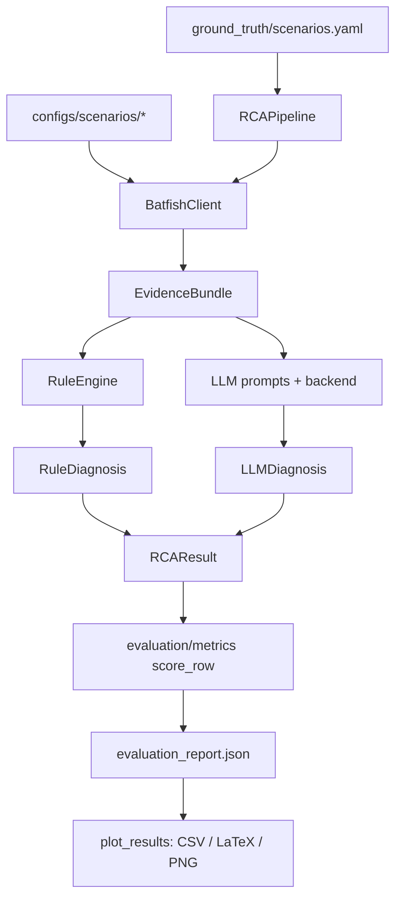

# How Campus RCA data generation works (under the hood)

This document explains how data flows from authored configs to dissertation tables/charts.

---

## 1. Scenario catalogue (what to test)

**`ground_truth/scenarios.yaml`** is the master list. Each scenario defines:

- `id`, `snapshot_dir` (which faulted configs to load)
- `symptom` (human text)
- `probe` (src/dst IP, port, protocol) — what Batfish will test
- `ground_truth` (expected fault type + device + keywords) — used only for scoring

Nothing “generates” this; it is authored as labelled lab faults.

---

## 2. Network data (the injected faults)

| Path | Role |
|---|---|
| `configs/baseline/` | Known-good campus (core1, dist1, dist2, border1 + hosts) |
| `configs/scenarios/<id>/` | Copy of baseline with **one** deliberate fault |

Examples:

- `acl_deny_http` → `dist2.cfg` removes HTTP permit on `CAMPUS_EDGE`
- `wrong_static_route` → `core1.cfg` default next-hop = `10.10.10.1`
- `interface_shutdown` → `core1` Gi0/1 `shutdown`

Hosts (`hosts/hostA.json` …) give Batfish endpoints like `10.10.10.10`.

---

## 3. Evidence generation — `batfish_client.py`

When Diagnose/Evaluate runs with Offline **unchecked**:

1. Connect to Batfish (`localhost`, network `campus`)
2. `init_snapshot(configs/scenarios/<id>)`
3. Run queries and convert DataFrames → JSON dicts:
   - `initIssues`
   - `interfaceProperties`
   - `routes`
   - `traceroute` + `reachability` (using the scenario probe)
   - `testFilters` (ACL behaviour on dist*)
4. Optionally load baseline for a light differential note
5. Wrap into **`EvidenceBundle`** (`models.py`)
6. Cache to `data/evidence_cache/<scenario_id>.json`

If Offline **checked** / `USE_BATFISH=false`:

- skips live Batfish
- uses `_synthetic_fallback()` — handcrafted evidence per scenario that still matches ground truth (for demos/CI)

A saved diagnose file such as `rca_result.json` is basically one full **`RCAResult`** including a live Batfish `EvidenceBundle`.

---

## 4. Orchestration — `pipeline.py`

`RCAPipeline.run_scenario(scenario, mode)`:

1. Build `ProbeSpec` from YAML
2. `collect()` → `EvidenceBundle`
3. Branch on mode:

| Mode | What runs | Who decides fault/device |
|---|---|---|
| `rule_only` | `RuleEngine.diagnose` | Rules |
| `llm_only` | `LLMBackend.diagnose_llm_only` | LLM |
| `hybrid` | Rules **then** LLM explain | **Rules** (LLM only explains) |

Output: **`RCAResult`** (evidence + optional rule/LLM diags + `final_*` fields + timing).

- GUI Diagnose / CLI `campus-rca diagnose` call this once.
- Evaluate loops: 5 scenarios × 3 modes → many `RCAResult`s.

---

## 5. Rule “data” — `rules/engine.py`

Pure Python over the evidence (no network):

- **R1 ACL deny** — DENY in acl_trace / denied dispositions
- **R2 interface down** — Active/Admin_Up false
- **R3 wrong static** — router default static next-hop into campus LAN (**not** host gateways)
- **R4 missing route** — NO_ROUTE / prefix absent from core OSPF
- **R5 OSPF neighbor** — init issues text
- **R0 OK** — reachable and no deny/no_route

Hits sorted by confidence → `primary` + `candidates` = **`RuleDiagnosis`**.

---

## 6. LLM “data” — `llm/prompts.py` + `llm/backend.py`

1. `compact_evidence()` shrinks routes/ACLs/traces (CPU-friendly)
2. Build system + user prompt
3. `OllamaBackend.complete()` → `POST /api/chat` (`format: json`)
4. Parse JSON (`_extract_json`, with repair/fallback) → **`LLMDiagnosis`**
5. Light hallucination flags (devices not in evidence, contradicting rules)

In **hybrid**, final fault/device still come from rules; LLM fills explanation/remediation.

---

## 7. Evaluation numbers — `evaluation/metrics.py` + `run_eval.py`

For each `RCAResult` vs YAML ground truth:

| Metric | Meaning |
|---|---|
| `localisation_correct` | fault type **and** device match |
| `keyword_coverage` | fraction of GT keywords in explanation |
| `hallucination_rate` | from LLM claim flags |
| `evidence_faithfulness` | cited refs exist in evidence |
| `elapsed_ms` | wall time |

`summarize()` aggregates per mode → **`evaluation_report.json`** + `.md`.

- GUI Evaluate writes under `results/gui_eval/`.
- CLI: `evaluation/run_eval.py --out results`.

---

## 8. Tables & charts — `evaluation/plot_results.py`

Reads `evaluation_report.json` and generates:

- `evaluation_rows.csv` / `evaluation_summary.csv`
- `evaluation_tables.tex`
- `figures/fig_*.png` (accuracy, metrics, OK/MISS matrix, latency)

Triggered by:

- Evaluate finishing (`write_report` auto-calls it)
- Results tab → **Generate figures**
- `make figures`

---

## 9. UI wiring — `gui.py`

| Tab | Calls |
|---|---|
| Setup | `setup_checks.py`, Ollama/Batfish scripts |
| Diagnose | `RCAPipeline.run_scenario` → show/save JSON |
| Evaluate | loop modes → `score_row` → `write_report` |
| Results | browse files → `plot_results.export_all` |

`run.sh` only bootstraps env (uv, Ollama, Batfish) then launches this GUI.

---

## Mental model (one sentence)

**You authored faulted configs + labels → Batfish turns them into structured evidence → rules/LLM turn evidence into diagnoses → metrics compare diagnoses to labels → plot_results turns scores into dissertation tables/charts.**

---

## Key source files

| File | Responsibility |
|---|---|
| `ground_truth/scenarios.yaml` | Labelled scenarios + probes + ground truth |
| `configs/baseline/`, `configs/scenarios/` | Device/host snapshots |
| `src/campus_rca/models.py` | Data shapes (`EvidenceBundle`, `RCAResult`, …) |
| `src/campus_rca/batfish_client.py` | Live/synthetic evidence collection |
| `src/campus_rca/rules/engine.py` | Deterministic fault classification |
| `src/campus_rca/llm/prompts.py` | Prompt compaction + templates |
| `src/campus_rca/llm/backend.py` | Ollama/OpenAI/mock completion + JSON parse |
| `src/campus_rca/pipeline.py` | End-to-end diagnose orchestration |
| `src/campus_rca/gui.py` / `cli.py` / `api.py` | Front ends |
| `evaluation/metrics.py` | Scoring + report JSON/MD |
| `evaluation/run_eval.py` | Full comparative evaluation loop |
| `evaluation/plot_results.py` | CSV / LaTeX / PNG export |
| `results/` | Generated reports, tables, figures |
