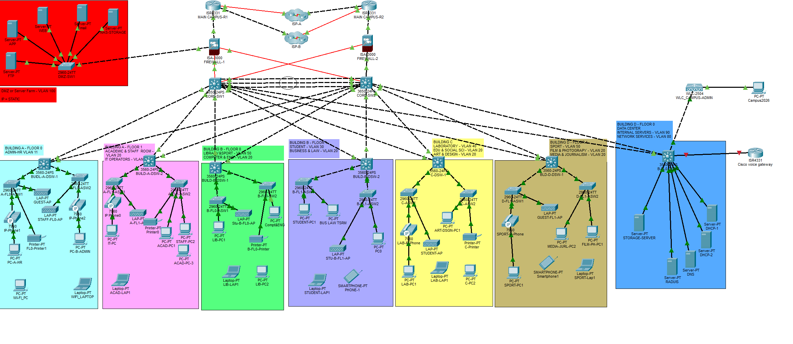

# University Main Campus Network Topology

This document maps the Packet Tracer physical/logical design onto the Batfish RCA lab used by the dissertation prototype.



## Justifying the Packet Tracer image (for the dissertation)

The Packet Tracer diagram is the **authoritative campus design artefact**. The Batfish laboratory is a **reduced, analysis-ready model** of that same design. They are intentionally related as follows.

### What the image justifies

1. **Design fidelity** — It shows the real intended architecture: dual head routers, dual firewalls, dual cores, DMZ, DC services, and distribution organised by building/floor blocks.
2. **Scope of the case study** — The RCA evaluation is set in this university main-campus network, not an abstract toy topology.
3. **Supervisor inspectability** — Distribution “by the block” in the diagram matches how the lab names and places DSWs (`dsw_a_admin`, `dsw_b_student`, etc.).
4. **Policy context** — ACLs and OSPF in the lab (`STUDENT-FILTER`, `GUEST-WLAN-FILTER`, `DMZ-IN`, area 0) come from the same campus configuration notes used to build the Packet Tracer network.

### What the Batfish model deliberately abstracts

Access switches, APs, WLC, IP phones, printers, and most end hosts are **not** duplicated as separate Batfish devices. They are represented as VLANs and host endpoints attached to the relevant distribution/core block. This is standard for configuration-analysis studies: Batfish needs device configs that affect routing and policy; cloning every Packet Tracer icon would add visual noise without improving root-cause localisation of the injected faults.

### One-sentence claim you can use

> *Figure X presents the Packet Tracer campus topology that defines the dual-core, dual-edge, block-based distribution design; the Batfish snapshots used for evaluation are a reduced but structurally faithful model of that topology, retaining the cores, head routers, firewalls, per-block distribution switches, addressing plan, and campus ACL/OSPF policies required for RCA.*

### Suggested figure caption

> **Figure X.** University main campus Packet Tracer topology (dual head routers, dual firewalls, dual cores, DMZ, and distribution by building/floor block). The Batfish RCA laboratory implements a reduced model of this design for automated evidence collection and evaluation.

## Design requirements addressed

| Requirement | Implementation |
|---|---|
| Two cores | `core_sw1`, `core_sw2` (redundant L3 cores, OSPF area 0) |
| Two head routers | `campus_r1`, `campus_r2` (dual edge to ISP) |
| Distribution by block | One DSW per building/floor block (supervisor can inspect block-by-block) |
| Scenario count | **10** labelled fault scenarios (was 5) |
| Policies from lab | STUDENT-FILTER, GUEST-WLAN-FILTER, DMZ-IN, OSPF from `ospf_acl_configs.txt` |

## High-level architecture

```text
                         INTERNET ISP
                       /              \
                campus_r1            campus_r2
                       \              /
                        fw1        fw2
                       /              \
                  core_sw1 ======== core_sw2
                     |  \          /  |
        +------------+   \        /   +------------+
        |                 \      /                  |
   Building blocks      DMZ / DC service blocks
   (distribution SW
    per colour block)
```

## Devices (Batfish snapshot names)

| Role | Hostname | Notes |
|---|---|---|
| Head router 1 | `campus_r1` | ISR4331 MAIN CAMPUS-R1 analogue |
| Head router 2 | `campus_r2` | ISR4331 MAIN CAMPUS-R2 analogue |
| Firewall 1 | `fw1` | ASA5506 FIREWALL-1 modelled as IOS + ACL |
| Firewall 2 | `fw2` | ASA5506 FIREWALL-2 modelled as IOS + ACL |
| Core 1 | `core_sw1` | 3560 CORE-SW1 |
| Core 2 | `core_sw2` | 3560 CORE-SW2 |
| Dist A FL0 | `dsw_a_admin` | Building A Floor 0 — Admin/HR |
| Dist A FL1 | `dsw_a_acad` | Building A Floor 1 — Academic/IT |
| Dist B FL0 | `dsw_b_lib` | Building B Floor 0 — Library |
| Dist B FL1 | `dsw_b_student` | Building B Floor 1 — Student cafe / Business |
| Dist C | `dsw_c_lab` | Building C — Laboratory |
| Dist D FL0 | `dsw_d_dc` | Building D Floor 0 — Data Centre services |
| Dist D FL1 | `dsw_d_media` | Building D Floor 1 — Sport/Film/Media |
| Dist DMZ | `dsw_dmz` | DMZ / server farm |

> Batfish analyses Cisco IOS-style configs well; ASA is represented as a router with DMZ ACLs so evidence remains deterministic for RCA.

## Addressing (from campus IP plan)

| Purpose | VLAN | Network | HSRP / gateway idea |
|---|---:|---|---|
| Management | 10 | 192.168.10.0/24 | .1 virtual / cores .2/.3 |
| Admin & HR | 11 | 192.168.11.0/24 | .1 |
| IT Staff | 12 | 192.168.12.0/24 | .1 |
| Academic Staff | 20 | 192.168.20.0/24 | .1 |
| Students | 30 | 192.168.30.0/24 | .1 |
| Computer Lab | 40 | 192.168.40.0/24 | .1 |
| Library & Sport | 50 | 192.168.50.0/24 | .1 |
| Staff WLAN | 55 | 11.10.55.0/24 | .1 |
| Student WLAN | 60 | 11.10.60.0/24 | .1 |
| Guest WLAN | 65 | 11.10.65.0/24 | .1 |
| VoIP | 70 | 192.168.70.0/24 | .1 |
| Printers/IoT | 75 | 192.168.75.0/24 | .1 |
| Network Services | 80 | 192.168.80.0/24 | .1 (DNS 192.168.80.13) |
| Internal Servers | 90 | 192.168.90.0/24 | .1 |
| DMZ | 100 | 12.20.20.0/26 | fw1/fw2 |

### Infrastructure links

| Link | Network | Device A | Device B |
|---|---|---|---|
| CORE1 ↔ FW1 | 192.168.250.0/30 | core_sw1 .1 | fw1 .2 |
| CORE2 ↔ FW2 | 192.168.250.4/30 | core_sw2 .5 | fw2 .6 |
| CORE1 ↔ CORE2 | 192.168.254.0/30 | core_sw1 .1 | core_sw2 .2 |
| R1 ↔ FW1 | 100.100.50.0/30 | campus_r1 .1 | fw1 .2 |
| R2 ↔ FW2 | 100.100.50.4/30 | campus_r2 .5 | fw2 .6 |

## Distribution “by the block” (supervisor view)

Each colour block in Packet Tracer maps to one distribution switch in the RCA lab:

| Packet Tracer block | Dist switch | Wired focus VLANs |
|---|---|---|
| Building A FL0 Admin/HR | `dsw_a_admin` | 11, 70, 75 |
| Building A FL1 Academic/IT | `dsw_a_acad` | 12, 20, 70 |
| Building B FL0 Library | `dsw_b_lib` | 50 |
| Building B FL1 Students | `dsw_b_student` | 30 |
| Building C Lab | `dsw_c_lab` | 40 |
| Building D FL0 DC | `dsw_d_dc` | 80, 90 |
| Building D FL1 Media | `dsw_d_media` | 50/media endpoints |
| DMZ server farm | `dsw_dmz` | 12.20.20.0/26 |

## Ten labelled RCA scenarios

| # | Scenario ID | Fault class | Device | Object |
|---|---|---|---|---|
| 1 | `student_acl_deny_mgt` | acl_deny | core_sw1 | STUDENT-FILTER |
| 2 | `guest_wlan_acl_deny` | acl_deny | core_sw1 | GUEST-WLAN-FILTER |
| 3 | `missing_ospf_students` | missing_route | dsw_b_student | 192.168.30.0/24 |
| 4 | `core1_uplink_shutdown` | interface_down | core_sw1 | GigabitEthernet0/1 |
| 5 | `wrong_default_route_r1` | wrong_static_route | campus_r1 | 0.0.0.0/0 |
| 6 | `ospf_omit_academic` | missing_route | dsw_a_acad | 192.168.20.0/24 |
| 7 | `dmz_to_lan_leak_attempt` | acl_deny | fw1 | DMZ-IN |
| 8 | `fw1_inside_shutdown` | interface_down | fw1 | GigabitEthernet0/0 |
| 9 | `core2_student_uplink_down` | interface_down | core_sw2 | GigabitEthernet0/2 |
| 10 | `missing_ospf_dns_services` | missing_route | dsw_d_dc | 192.168.80.0/24 |

Ground truth lives in `ground_truth/scenarios.yaml`. Snapshot dirs are under `configs/scenarios/<id>/`.

## Source artefacts

- Packet Tracer diagram: `CAMPUS-NETWORK-TOPOLOGY.png` (same image as `../RCA-TOPOLOGY.png`)
- ACL lab notes: `ACL CONFIGURATIONS.txt`
- VLAN / HSRP plan: `VLANS IP  ADDRESS AND GATEWAY.txt`
- Edge / core addressing: `ROUTERS, FW, CORE-SW CONFIG.txt`
- Batfish baseline: `configs/baseline/`
- Faulted snapshots: `configs/scenarios/`
